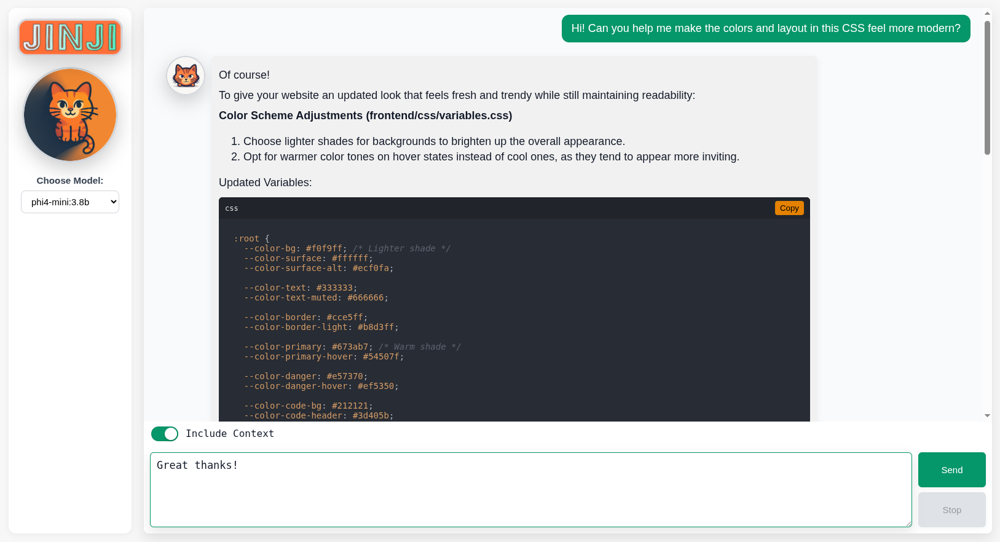

# JINJI - An Electron App for interacting with local LLMs.

JINJI is an intuitive, offline-first interface designed to seamlessly interact with locally installed LLMs powered by Ollama, offering an efficient and private AI experience without the need for an internet connection.

---

## Features

- Chat interface with a clean and interactive UI
- Fully local execution with no external API calls
- Support for multiple locally installed LLMs with Ollama: https://ollama.com/
- Easy model switching depending on the task
- Electron desktop app

---

## UI Preview

<p align="center">
  
</p>

---

## Tech Stack

- **Frontend:** HTML, CSS, JavaScript
- **Backend:** Python (FastAPI, Uvicorn)
- **LLM Runtime:** Ollama
- **Architecture:** Local-first, offline AI system
- **Desktop Application:** Electron

---

## Architecture Overview

The application runs entirely on the local machine:

- Electron hosts the app in a desktop window
- The FastAPI backend handles requests and model communication
- Ollama serves locally installed LLMs
- No external APIs or internet connection required

This design ensures:
- Full privacy
- Low latency
- Offline usability

---

## Requirements

- Ollama https://ollama.com/
- Python 3
- Node.js and npm (for Electron app)
- Dependencies listed in requirements.txt

---

## Installation

1. Clone the repository:

```bash
git clone <your-repo-url>
cd <repo-directory>
```

2. Install Python dependencies:

```bash
pip install -r requirements.txt
```

3. Ensure Ollama is installed and models are downloaded:

```bash
ollama pull <model-name>
```

> JINJI works great with phi4-mini:3.8b

4. Set up the Electron App in the root directory:

```bash
npm install
```

---

## Usage

1. To run the application as a standalone Electron desktop app:

```bash
npm start
```

The launcher will:

- Start Ollama if it is not already running
- Launch the FastAPI backend (uvicorn)
- Open the Electron desktop window pointing to the local server (http://localhost:8000).
- Automatically handle backend startup, waiting for readiness, and shutdown when the window is closed.

2. You can also create a convenient .desktop launcher icon to easily launch the application from your desktop environment. Simply follow these steps:

- Download or create a .desktop file (example provided below).
- Save it to your ~/.local/share/applications/ directory.
- You can then launch JINJI directly from your desktop environment.

```bash
[Desktop Entry]
Version=1.0
Name=JINJI
Comment=Run JINJI - Local LLM Chatbot Interface
Exec=gnome-terminal -- bash -c "cd /path/to/JINJI/ && export BROWSER=true; npm start; echo 'Ollama and local server terminated.'; echo 'Press enter to close...'; read; exit"
Icon=/path/to/JINJI/frontend/assets/images/logo.png
Terminal=false
Type=Application
```

Make sure to replace /path/to/JINJI/ with the actual path where JINJI is located.

---

## Licensing

**JINJI** © Thomas Edward Ash https://github.com/T-Ash-90. This software is released under the [MIT License](./LICENSE).

### Third-Party Attributions & Acknowledgements

- **DOMPurify** (v3.3.3) — © Cure53 and other contributors, released under the [Apache License 2.0](https://www.apache.org/licenses/LICENSE-2.0) and [Mozilla Public License 2.0](https://www.mozilla.org/en-US/MPL/2.0/). Used for safe sanitization of HTML/Markdown.  
- **marked** (v15.0.12) — © 2011–2025 Christopher Jeffrey, MIT Licensed. [GitHub repo](https://github.com/markedjs/marked). Used for parsing Markdown.  
- **Highlight.js** (v11.9.0) — © Igor Sysoev and other contributors, BSD-3-Clause Licensed. [GitHub repo](https://github.com/highlightjs/highlight.js). Used for syntax highlighting in code blocks.  
- **Atom One Dark Theme** (for Highlight.js) — © Alexander Gugel, BSD-3-Clause Licensed. [GitHub repo](https://github.com/highlightjs/highlight.js/tree/main/src/styles). Used as the code block styling theme.
- **Electron (v41.1.1)** — © 2013–2023 GitHub, Inc., MIT Licensed. [GitHub repo](https://github.com/electron/electron). Used to build cross-platform desktop application.

> ⚠️ Note: This project is intended for learning and personal use. It is not associated with any company or product.

---
